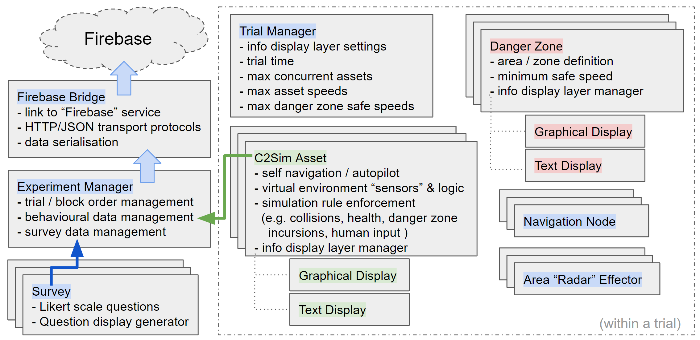

# SimpleC2Sim

SimpleC2Sim is an open source experimental platform used in this paper:

https://dl.acm.org/doi/10.1145/3687272.3688305 

Written by Matt Cabanag.
Distributed under the MIT license.

In the following weeks, I will be updating this readme file to help prospective users take advantage of SimpleC2Sim. In the mean time, please contact me (matt.cabanag@unsw.edu.au) if you're interested in using SimpleC2Sim and I can help you directly.

----

SimpleC2Sim is a, web-deployable, low fidelity, command \& control (C2) simulator, with provisions for factorial user experiments. This platform is open source and available for researchers to take advantage of. The main desirable features of the platform are:

* Data gathering for behavioural measures of trust calibration.
* Able to gather data from a large participant pool in a short amount of time.
* Reduced workload for experimenter; with experiments able to run unsupervised.
* Block-Trial management framework for factorial experimental designs.
* Display layer system for multi-tiered transparency schemes.
* Simple, reactive agent framework, designed for focused human factors testing.

SimpleC2Sim is built in Unity3D, a popular commercial game engine. This engine is able to deploy to WebGL, which allows SimpleC2Sim experiments to run on web browsers. SimpleC2Sim is currently configured to work with Firebase, a cloud service run by Google, however it is also possible to use other JSON based database services. Data is posted to Firebase, via a standard JSON POST request. Experiment management modules and reactive agents are written in C\#. Scripts to convert JSON data to CSV format for analysis are written in Python. Prospective users of SimpleC2Sim are expected to be familiar with these technologies. 

An overview of the system architecture:

